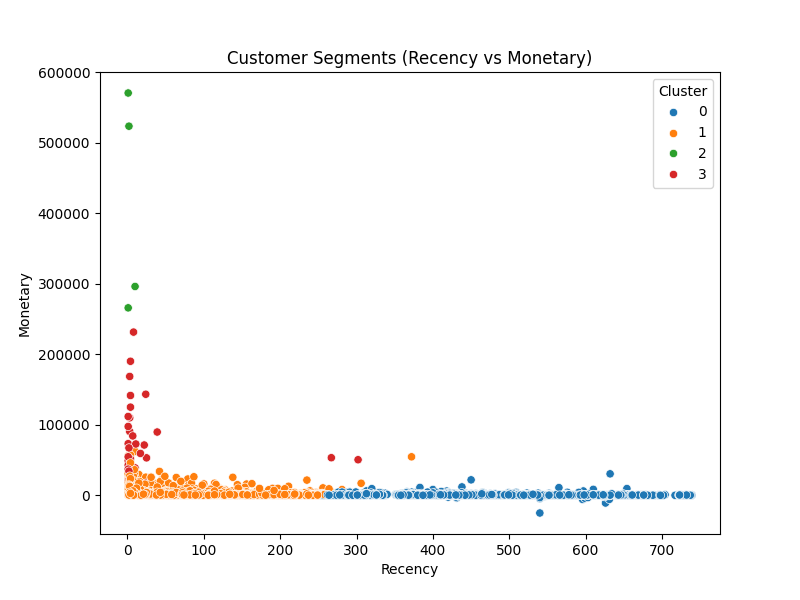

# Customer Behavior Segmentation Project (Business Analytics)



## Overview
This project demonstrates end-to-end customer segmentation using real-world retail data. By applying RFM (Recency, Frequency, Monetary) analysis and clustering techniques, we identify actionable customer segments to drive targeted marketing and business strategies.

## Objectives
- Clean and preprocess raw retail transaction data
- Calculate RFM metrics for each customer
- Segment customers using KMeans clustering
- Visualize and interpret customer segments
- Provide business recommendations based on insights

## Data
- **Source:** [UCI Online Retail Dataset](https://archive.ics.uci.edu/ml/datasets/Online+Retail) (`data/raw_data.csv`)
- **Fields:** Invoice, StockCode, Description, Quantity, InvoiceDate, Price, Customer ID, Country
- **Processed files:**
  - `data/cleaned_data.csv`: Cleaned and preprocessed data
  - `data/rfm_table.csv`: RFM metrics for each customer
  - `data/rfm_clusters.csv`: RFM metrics with cluster labels

## Methodology
1. **Data Cleaning:** Remove duplicates, handle missing values, and standardize columns.
2. **RFM Analysis:** Calculate Recency, Frequency, and Monetary value for each customer.
3. **Clustering:** Use KMeans to segment customers based on RFM scores.
4. **Visualization:** Generate plots to interpret and present customer segments.
5. **Executive Summary:** Summarize findings and business recommendations in a PDF report.

## How to Run
1. **Install dependencies:**
   ```bash
   pip install -r requirements.txt
   ```
2. **Place your raw data:**
   - Save your dataset as `data/raw_data.csv`.
3. **Run the analysis pipeline:**
   - From the project root, run each script in order:
     ```bash
     python src/data_cleaning.py
     python src/rfm_analysis.py
     python src/clustering.py
     python src/visualizations.py
     ```
4. **Explore the notebook:**
   - Open `notebooks/segmentation_analysis.ipynb` in Jupyter for a step-by-step walkthrough.
5. **View results:**
   - Cleaned data and outputs in `data/`
   - Figures in `reports/figures/`
   - Executive summary in `reports/segmentation_summary.pdf`
6. **(Optional) Launch the dashboard:**
   ```bash
   streamlit run dashboard/streamlit_app.py
   ```

## Project Structure
```
customer-segmentation/
├── data/
│   ├── raw_data.csv
│   ├── cleaned_data.csv
│   ├── rfm_table.csv
│   └── rfm_clusters.csv
├── notebooks/
│   └── segmentation_analysis.ipynb
├── reports/
│   ├── segmentation_summary.pdf
│   └── figures/
│       ├── rfm_distribution.png
│       ├── clusters_plot.png
│       └── customer_segments_chart.png
├── src/
│   ├── data_cleaning.py
│   ├── rfm_analysis.py
│   ├── clustering.py
│   └── visualizations.py
├── dashboard/
│   └── streamlit_app.py
├── requirements.txt
├── README.md
└── .gitignore
```

## Tools Used
- Python
- pandas
- scikit-learn
- matplotlib
- seaborn
- Streamlit

## Skills Demonstrated
- Data Cleaning
- RFM Analysis
- Clustering
- Business Analytics

## Contact
For questions or collaboration, contact [pranavi@immanni.com](mailto:pranavi@immanni.com) or connect on [LinkedIn](https://www.linkedin.com/in/pranavi-immanni-ab04a823b).
