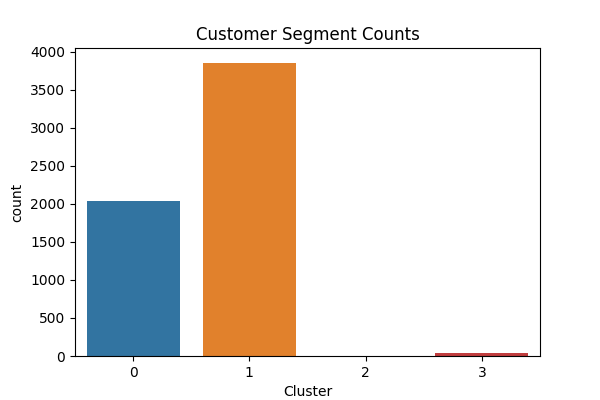
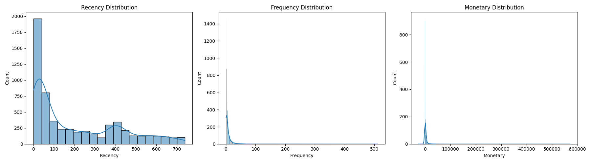
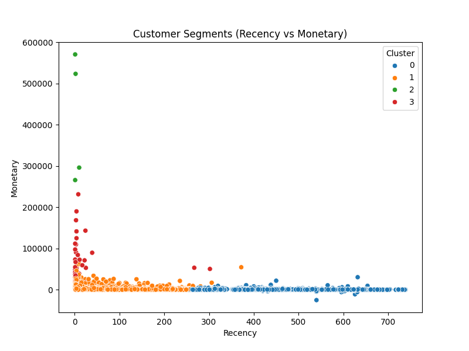

# 👥 Customer Behavior Segmentation Analysis

[](https://python.org)
[](https://scikit-learn.org)
[](LICENSE)
[]()

## 🎯 Project Overview

A comprehensive customer segmentation project that demonstrates advanced RFM (Recency, Frequency, Monetary) analysis and machine learning clustering techniques. This project showcases end-to-end customer analytics from data preprocessing to actionable business insights and interactive dashboard development.

## 🚀 Key Features

- **📊 RFM Analysis**: Advanced customer segmentation using Recency, Frequency, Monetary metrics
- **🤖 Machine Learning**: K-means clustering for customer segment identification
- **📈 Interactive Dashboard**: Streamlit-based business intelligence dashboard
- **📋 Business Insights**: Actionable recommendations for marketing strategies
- **🔍 Data Visualization**: Professional charts and statistical analysis
- **📊 Executive Reporting**: Comprehensive PDF reports for stakeholders
- **🔧 Modular Design**: Clean, extensible codebase for easy customization

## 🛠️ Technologies Used

| Technology | Purpose | Version |
|------------|---------|---------|
| **Python** | Core programming language | 3.8+ |
| **pandas** | Data manipulation and analysis | Latest |
| **scikit-learn** | Machine learning and clustering | Latest |
| **matplotlib/seaborn** | Data visualization | Latest |
| **Streamlit** | Interactive dashboard | Latest |
| **numpy** | Numerical computations | Latest |

## 📁 Project Structure

```
Customer Behavior Segmentation/
├── 📊 dashboard/                          # Interactive dashboard
│   └── streamlit_app.py                   # Streamlit web application
├── 📁 data/                              # Data storage
│   ├── raw_data.csv                      # Original dataset
│   ├── cleaned_data.csv                  # Preprocessed data
│   ├── rfm_table.csv                     # RFM metrics
│   └── rfm_clusters.csv                  # Clustered segments
├── 📊 reports/                           # Analysis outputs
│   ├── figures/                          # Generated visualizations
│   │   ├── clusters_plot.png
│   │   ├── customer_segments_chart.png
│   │   └── rfm_distribution.png
│   └── segmentation_summary.pdf          # Executive summary
├── 🐍 src/                               # Source code
│   ├── data_cleaning.py                  # Data preprocessing
│   ├── rfm_analysis.py                   # RFM calculations
│   ├── clustering.py                     # ML clustering
│   └── visualizations.py                 # Chart generation
├── 📋 requirements.txt                   # Python dependencies
└── 📖 README.md                          # This file
```

## 🚀 Quick Start

### Prerequisites
- Python 3.8 or higher
- pip package manager

### Installation

1. **Clone the repository:**
   ```bash
   git clone https://github.com/PranaviImmanni/Portfolio.git
   cd Portfolio/Customer\ Behavior\ Segmentation/
   ```

2. **Install dependencies:**
   ```bash
   pip install -r requirements.txt
   ```

3. **Prepare your data:**
   ```bash
   # Place your retail transaction data as 'data/raw_data.csv'
   # Expected columns: Invoice, StockCode, Description, Quantity, 
   #                   InvoiceDate, Price, Customer ID, Country
   ```

4. **Run the analysis pipeline:**
     ```bash
   # Step 1: Data cleaning
     python src/data_cleaning.py
   
   # Step 2: RFM analysis
     python src/rfm_analysis.py
   
   # Step 3: Customer clustering
     python src/clustering.py
   
   # Step 4: Generate visualizations
     python src/visualizations.py
     ```

5. **Launch the interactive dashboard:**
   ```bash
   streamlit run dashboard/streamlit_app.py
   ```

## 📊 Usage Examples

### Data Processing Pipeline
```python
# Data cleaning and preprocessing
from src.data_cleaning import clean_retail_data

# Load and clean data
raw_data = pd.read_csv('data/raw_data.csv')
cleaned_data = clean_retail_data(raw_data)
```

### RFM Analysis
```python
# Calculate RFM metrics
from src.rfm_analysis import calculate_rfm_metrics

# Generate RFM scores
rfm_data = calculate_rfm_metrics(cleaned_data)
```

### Customer Clustering
```python
# Perform K-means clustering
from src.clustering import perform_customer_clustering

# Identify customer segments
segments = perform_customer_clustering(rfm_data)
```

### Interactive Dashboard
```python
# Launch Streamlit dashboard
import streamlit as st

# Dashboard provides:
# - Customer segment overview
# - RFM distribution analysis
# - Interactive filtering
# - Business recommendations
```

## 📈 Analysis Capabilities

### 📊 RFM Analysis
- **Recency**: Days since last purchase
- **Frequency**: Number of transactions
- **Monetary**: Total spending amount
- **RFM Scoring**: 1-5 scale for each dimension
- **Segment Classification**: Customer behavior categorization

### 🤖 Machine Learning Clustering
- **K-means Clustering**: Optimal cluster identification
- **Elbow Method**: Optimal K selection
- **Silhouette Analysis**: Cluster quality assessment
- **Segment Profiling**: Detailed customer characteristics

### 📈 Business Intelligence
- **Customer Lifetime Value**: CLV calculations and predictions
- **Churn Risk Assessment**: Identify at-risk customers
- **Marketing Recommendations**: Targeted campaign strategies
- **Performance Metrics**: Segment profitability analysis

## 📊 Sample Output

### Customer Segments


### RFM Distribution


### Cluster Analysis


## 🧪 Technical Implementation

### RFM Calculation
```python
def calculate_rfm_metrics(data):
    """
    Calculate Recency, Frequency, Monetary metrics
    """
    # Recency: Days since last purchase
    recency = data.groupby('CustomerID')['InvoiceDate'].max()
    recency = (data['InvoiceDate'].max() - recency).dt.days
    
    # Frequency: Number of transactions
    frequency = data.groupby('CustomerID')['Invoice'].nunique()
    
    # Monetary: Total spending
    data['TotalAmount'] = data['Quantity'] * data['Price']
    monetary = data.groupby('CustomerID')['TotalAmount'].sum()
    
    return pd.DataFrame({
        'Recency': recency,
        'Frequency': frequency,
        'Monetary': monetary
    })
```

### K-means Clustering
```python
def perform_customer_clustering(rfm_data):
    """
    Perform K-means clustering on RFM data
    """
    from sklearn.cluster import KMeans
    from sklearn.preprocessing import StandardScaler
    
    # Standardize the data
    scaler = StandardScaler()
    rfm_scaled = scaler.fit_transform(rfm_data)
    
    # Find optimal number of clusters
    optimal_k = find_optimal_clusters(rfm_scaled)
    
    # Perform clustering
    kmeans = KMeans(n_clusters=optimal_k, random_state=42)
    clusters = kmeans.fit_predict(rfm_scaled)
    
    return clusters
```

### Business Insights Generation
```python
def generate_business_insights(segments):
    """
    Generate actionable business recommendations
    """
    insights = {}
    
    for segment in segments:
        if segment == 'Champions':
            insights[segment] = 'Retain and reward these customers'
        elif segment == 'Potential Loyalists':
            insights[segment] = 'Encourage repeat purchases'
        elif segment == 'At Risk':
            insights[segment] = 'Win-back campaigns needed'
        # ... additional segment insights
    
    return insights
```

## 🎯 Key Insights & Applications

### 💼 Business Applications
- **Customer Retention**: Identify and retain high-value customers
- **Marketing Campaigns**: Targeted messaging for different segments
- **Product Development**: Understand customer preferences
- **Revenue Optimization**: Focus on profitable customer segments

### 📊 Technical Skills Demonstrated
- **Data Preprocessing**: Cleaning and transforming retail data
- **RFM Analysis**: Advanced customer segmentation techniques
- **Machine Learning**: Unsupervised learning and clustering
- **Business Intelligence**: Dashboard development and reporting
- **Statistical Analysis**: Customer behavior pattern identification

## 🔧 Customization & Extension

### Adding New Metrics
```python
# Custom RFM variations
def calculate_custom_rfm(data):
    # Add your custom metrics here
    # e.g., Product diversity, Brand loyalty, etc.
    pass
```

### Advanced Clustering
```python
# Try different clustering algorithms
from sklearn.cluster import DBSCAN, AgglomerativeClustering

def advanced_clustering(data):
    # DBSCAN for density-based clustering
    # Hierarchical clustering for tree-like structures
    pass
```

### Dashboard Enhancements
```python
# Add new dashboard features
def add_custom_metrics():
    # Real-time updates
    # Advanced filtering
    # Export functionality
    pass
```

## 📚 Learning Outcomes

This project demonstrates proficiency in:

- **Customer Analytics**: RFM analysis and segmentation techniques
- **Machine Learning**: Clustering algorithms and model evaluation
- **Data Visualization**: Professional charts and interactive dashboards
- **Business Intelligence**: Converting data insights into actionable strategies
- **Python Development**: Clean, modular, and maintainable code
- **Statistical Analysis**: Customer behavior pattern identification

## 🤝 Contributing

Contributions are welcome! Please feel free to submit:

- **Algorithm Improvements**: Enhanced clustering or RFM techniques
- **Dashboard Features**: New visualization or interaction capabilities
- **Business Insights**: Additional analysis methodologies
- **Documentation**: Improvements to guides and examples

## 📄 License

This project is licensed under the MIT License - see the [LICENSE](LICENSE) file for details.

## 📞 Contact & Support

**Pranavi Immanni**  
📧 **Email:** [pranavi@immanni.com](mailto:pranavi@immanni.com)  
🔗 **LinkedIn:** [Pranavi Immanni](https://www.linkedin.com/in/pranavi-immanni-ab04a823b)  
🐙 **GitHub:** [@PranaviImmanni](https://github.com/PranaviImmanni)

---

## 🏆 Project Highlights

- ✅ **Advanced Analytics**: Sophisticated RFM analysis and ML clustering
- ✅ **Business Value**: Actionable insights for marketing and retention
- ✅ **Interactive Dashboard**: Professional Streamlit application
- ✅ **Production Ready**: Clean, documented, and extensible code
- ✅ **Educational Value**: Demonstrates advanced customer analytics skills

*This project showcases advanced customer segmentation, machine learning, and business intelligence skills suitable for senior data science and marketing analytics roles.*