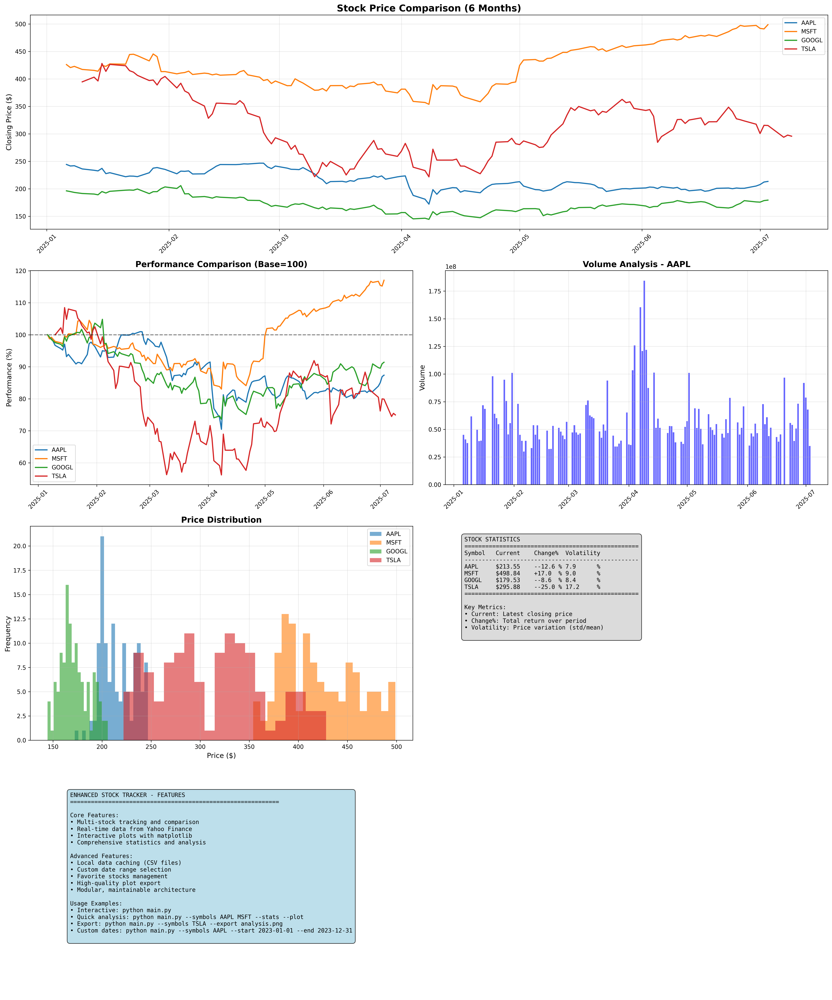
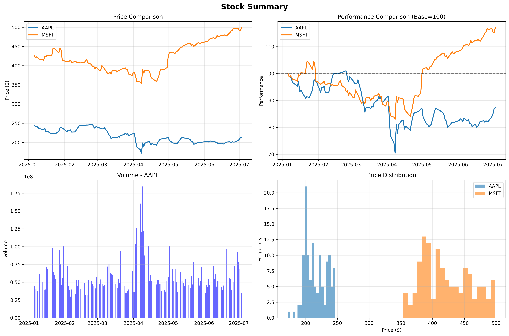
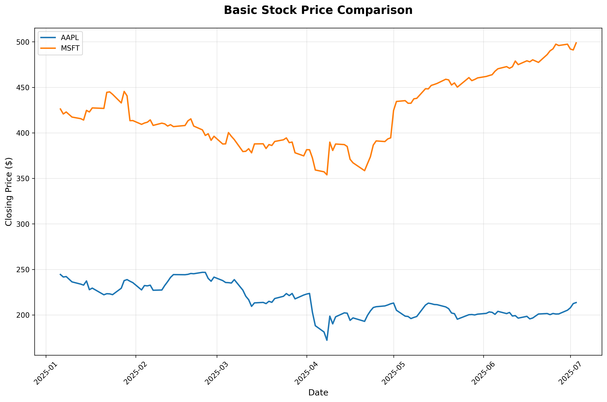

<<<<<<< HEAD
# Enhanced Stock Tracker

A powerful, modular Python application for tracking and analyzing stock prices with advanced features including data visualization, caching, and interactive CLI interface.

## Images

### Main Application Interface

*The main interactive menu showing all available options*

### Stock Analysis Example

*Sample stock price comparison chart for AAPL, MSFT, GOOGL, and TSLA*

### Statistics Display

*Comprehensive statistics table showing current prices, changes, and volatility*

### Performance Comparison

*Normalized performance comparison chart (base=100) for multiple stocks*

### Export Example

*High-quality exported plot showing stock price trends*

### Project Structure

*File structure and organization of the modular codebase*

## Project Structure

```
stock-tracker/
├── main.py              # Entry point, user interaction, menu
├── stock_data.py        # Functions to fetch & save stock data
├── plotter.py           # Functions to plot data
├── utils.py             # Helper functions (e.g., formatting, stats)
├── data/                # Folder to store CSV files
├── README.md            # Project overview & instructions
└── requirements.txt     # Python dependencies
```

## Features

### Core Features
- **Multi-Stock Tracking**: Input multiple stock symbols and track them simultaneously
- **6-Month Data Analysis**: Download and analyze 6 months of historical stock data
- **Beautiful Visualizations**: Plot closing prices with matplotlib featuring clear labels, legends, and grids
- **Real-time Statistics**: View max, min, average prices, and percentage changes

### Advanced Features
- **Local Data Caching**: Save downloaded data as CSV files for faster future loads
- **Custom Date Ranges**: Select specific start and end dates for analysis
- **Favorite Stocks**: Save and manage your favorite stock list
- **Export Functionality**: Save plots as high-quality PNG images
- **Interactive CLI Menu**: User-friendly command-line interface
- **Comprehensive Statistics**: Detailed price analysis with visual indicators
- **Modular Architecture**: Clean, maintainable code structure

## Installation

1. **Clone or download the project**
2. **Install dependencies**:
   ```bash
   pip install -r requirements.txt
   ```

## Requirements

- Python 3.7+
- yfinance (for stock data)
- matplotlib (for plotting)
- pandas (for data manipulation)
- numpy (for calculations)

## Usage

### Interactive Mode (Recommended)
Run the application without arguments to access the interactive menu:

```bash
python main.py
```

### Command Line Mode
For quick analysis or automation:

```bash
# Track specific stocks with 6-month data
python main.py --symbols AAPL MSFT GOOGL

# Show statistics only
python main.py --symbols AAPL MSFT --stats

# Show plot
python main.py --symbols AAPL MSFT --plot

# Export plot to file
python main.py --symbols AAPL MSFT --export my_plot.png

# Custom time period
python main.py --symbols AAPL MSFT --period 1y

# Use favorite stocks
python main.py --favorites --plot

# Custom date range
python main.py --symbols AAPL MSFT --start 2023-01-01 --end 2023-12-31 --plot
```

## Interactive Menu Options

1. **Track Stocks (6 months)**: Analyze 6 months of data for multiple stocks
2. **Track Stocks (Custom Date Range)**: Specify custom start and end dates
3. **Manage Favorite Stocks**: Add, remove, and track your favorite stocks
4. **View Statistics**: Get detailed statistics for specific stocks
5. **Export Plot**: Save the current plot as a PNG image
6. **Clear Cached Data**: Remove all cached CSV files
7. **Help**: Show usage information and tips
8. **Exit**: Close the application

## Features in Detail

### Data Caching
- Stock data is automatically saved to `data/` directory as CSV files
- Subsequent runs use cached data for faster loading
- Clear cache option available in the menu

### Statistics Display
The application shows comprehensive statistics including:
- Current price
- Maximum price in the period
- Minimum price in the period
- Average price
- Total change (dollar amount)
- Percentage change with visual indicators (+ for positive, - for negative)
- Volatility percentage

### Plotting Features
- Multiple stocks plotted on the same graph
- Clear labels and legends
- Grid lines for easy reading
- Professional styling with proper fonts and colors
- Automatic date formatting on x-axis
- High-quality export options

### Favorite Stocks Management
- Save frequently tracked stocks
- Persistent storage in `favorites.json`
- Quick access to track all favorites at once
- Easy add/remove functionality

## Module Documentation

### main.py
- **Purpose**: Application entry point and user interface
- **Key Classes**: `StockTrackerApp`
- **Features**: Interactive menu, command-line argument parsing, error handling

### stock_data.py
- **Purpose**: Data fetching and caching
- **Key Classes**: `StockDataManager`
- **Features**: Yahoo Finance integration, CSV caching, batch downloads

### plotter.py
- **Purpose**: Data visualization
- **Key Classes**: `StockPlotter`
- **Features**: Multiple plot types, styling, export functionality

### utils.py
- **Purpose**: Helper functions and utilities
- **Key Classes**: `StockUtils`
- **Features**: Statistics calculation, input validation, favorites management

## Example Output

### Statistics Table
```
====================================================================================================
STOCK STATISTICS
====================================================================================================
Symbol   Current    Max        Min        Avg        Change     Change%   Volatility
----------------------------------------------------------------------------------------------------
AAPL     $150.25    $175.50    $120.30    $145.20    $15.25     +11.3%    12.5%
MSFT     $320.45    $350.20    $280.10    $315.30    $25.15     +8.5%     8.2%
GOOGL    $2,850.30  $3,100.50  $2,600.20  $2,750.40  $-50.10    -1.7%     15.1%
====================================================================================================
```

### Interactive Menu
```
============================================================
ENHANCED STOCK TRACKER
============================================================
1. Track Stocks (6 months)
2. Track Stocks (Custom Date Range)
3. Manage Favorite Stocks
4. View Statistics
5. Export Plot
6. Clear Cached Data
7. Help
8. Exit
============================================================
```

## Customization

### Time Periods
Available periods for yfinance:
- `1d`, `5d`, `1mo`, `3mo`, `6mo`, `1y`, `2y`, `5y`, `10y`, `ytd`, `max`

### Plot Customization
The plotting module can be easily modified to:
- Change colors and line styles
- Adjust figure size
- Modify grid appearance
- Add additional technical indicators

### Adding New Features
The modular structure makes it easy to add new features:
1. Add new methods to existing classes
2. Create new modules for specialized functionality
3. Extend the main menu with new options

## Troubleshooting

### Common Issues

1. **Import errors**: Make sure all dependencies are installed:
   ```bash
   pip install -r requirements.txt
   ```

2. **No data found**: Some stock symbols might not be available on Yahoo Finance

3. **Plot not showing**: Ensure you have a display environment (for headless servers, use `--export` instead of `--plot`)

4. **Slow loading**: First run downloads data; subsequent runs use cached data for speed

5. **Module import errors**: Ensure all Python files are in the same directory

### Error Messages
- `Invalid symbol format`: Use letters only (e.g., AAPL, MSFT)
- `Invalid date format`: Use YYYY-MM-DD format
- `Could not display plot`: Use `--export` option for headless environments

## Future Enhancements

Potential features for future versions:
- Technical indicators (RSI, MACD, moving averages)
- Portfolio tracking with shares and total value
- Real-time price updates
- Web interface
- Email alerts for price changes
- Integration with other data sources
- Advanced chart types (candlestick, volume analysis)
- Risk analysis and correlation matrices

## Contributing

The modular structure makes it easy to contribute:

1. **Adding new features**: Create new modules or extend existing ones
2. **Improving plots**: Modify `plotter.py` for new visualization types
3. **Enhancing data**: Extend `stock_data.py` for additional data sources
4. **Better utilities**: Add new helper functions to `utils.py`

## License

This project is open source and available under the MIT License.

## Quick Start Examples

```bash
# Basic usage - interactive mode
python main.py

# Quick analysis of tech stocks
python main.py --symbols AAPL MSFT GOOGL TSLA --stats --plot

# Export analysis for presentation
python main.py --symbols AAPL MSFT --export tech_analysis.png

# Analyze specific time period
python main.py --symbols AAPL --start 2023-01-01 --end 2023-12-31 --plot

# Use saved favorites
python main.py --favorites --export favorites_analysis.png
``` 
=======
# Portfolio

Welcome to my portfolio showcasing data analysis, programming, and technical projects. This repository contains a collection of projects demonstrating various skills in Python, SQL, data analysis, and software development.

## Projects

### 📈 [Stock Tracker](stock-tracker/)
A professional-grade stock analysis application built with Python. Features include real-time data fetching, interactive CLI, data visualization, and modular architecture.

**Technologies:** Python, yfinance, matplotlib, pandas, modular architecture
**Key Features:**
- Real-time stock data from Yahoo Finance
- Interactive command-line interface
- Data caching and export functionality
- Comprehensive statistics and visualizations
- Professional plotting with matplotlib

### 🎵 [SQL Music Analysis](sql-music-analysis/)
Database analysis project using SQL to explore music data patterns, trends, and insights.

**Technologies:** SQL, Database Management, Data Analysis
**Key Features:**
- Complex SQL queries and analysis
- Music industry data exploration
- Statistical insights and trends
- Sample datasets for demonstration

### 🧹 [Data Cleaning Project](data-cleaning-project/)
Jupyter notebook demonstrating data cleaning techniques, preprocessing, and quality assurance.

**Technologies:** Python, Jupyter, pandas, data preprocessing
**Key Features:**
- Data quality assessment
- Cleaning and preprocessing techniques
- Missing value handling
- Data validation and transformation

## Skills Demonstrated

### Programming Languages
- **Python**: Advanced data analysis, web scraping, automation
- **SQL**: Database queries, data manipulation, analysis
- **Jupyter**: Interactive data exploration and documentation

### Data Analysis & Visualization
- **Statistical Analysis**: Descriptive statistics, trend analysis
- **Data Visualization**: Matplotlib, interactive charts
- **Data Cleaning**: Preprocessing, quality assurance
- **Real-time Data**: API integration, live data feeds

### Software Development
- **Modular Architecture**: Clean, maintainable code structure
- **Command Line Interfaces**: User-friendly CLI applications
- **Documentation**: Comprehensive README files and examples
- **Version Control**: Git workflow and project management

### Tools & Technologies
- **Data Sources**: Yahoo Finance API, SQL databases
- **Development Tools**: Git, Jupyter Notebooks, VS Code
- **Libraries**: pandas, matplotlib, yfinance, numpy

## Getting Started

Each project contains its own README with detailed setup and usage instructions. To get started:

1. **Clone this repository**
   ```bash
   git clone https://github.com/PranaviImmanni/Portfolio.git
   cd Portfolio
   ```

2. **Explore individual projects**
   - [Stock Tracker](stock-tracker/) - Run `python main.py` for interactive analysis
   - [SQL Music Analysis](sql-music-analysis/) - Execute SQL queries on sample data
   - [Data Cleaning Project](data-cleaning-project/) - Open Jupyter notebooks

3. **Install dependencies** as needed for each project

## Project Highlights

### Stock Tracker
- **Professional-grade application** with modular architecture
- **Real-time data integration** from financial APIs
- **Interactive user interface** with comprehensive features
- **Data persistence** and export capabilities

### SQL Music Analysis
- **Complex database queries** and analysis
- **Music industry insights** and trend analysis
- **Statistical modeling** and data exploration

### Data Cleaning Project
- **Data quality assessment** and improvement
- **Preprocessing techniques** and best practices
- **Automated cleaning workflows**

## Contact & Links

- **GitHub**: [PranaviImmanni](https://github.com/PranaviImmanni)
- **LinkedIn**: [Your LinkedIn Profile]
- **Email**: [your.email@example.com]

## License

This portfolio is open source and available under the MIT License. Individual projects may have their own licensing terms.

---

*This portfolio demonstrates my passion for data analysis, programming, and creating practical solutions to real-world problems.* 
>>>>>>> 4f86642 (Add portfolio structure with SQL and data cleaning projects)
