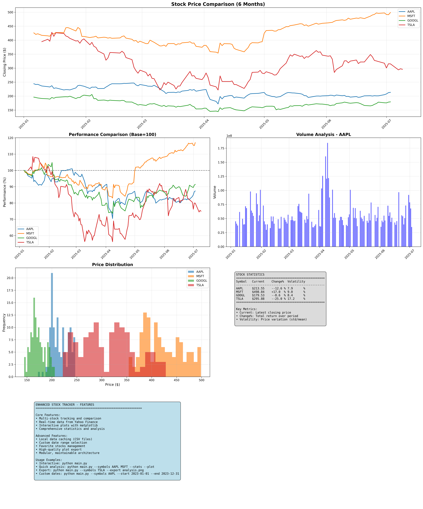
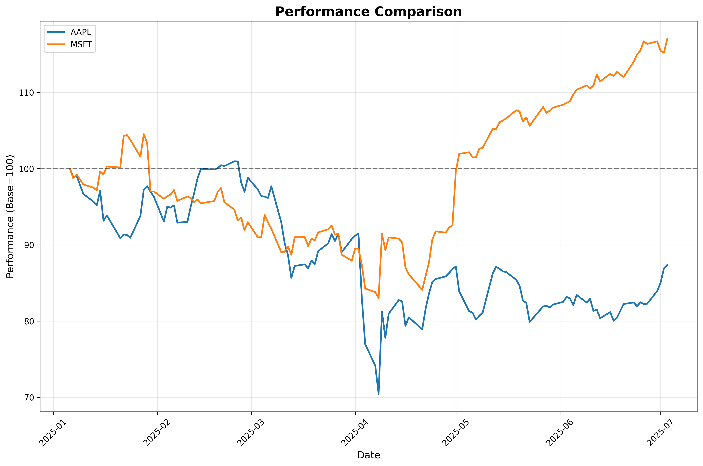

# 📈 Stock Market Tracker & Analysis

[](https://python.org)
[](LICENSE)
[]()

## 🎯 Project Overview

A comprehensive Python application for tracking, analyzing, and visualizing stock market data. This project demonstrates advanced financial data analysis, real-time API integration, and professional visualization techniques suitable for both individual investors and financial professionals.

## 🚀 Key Features

- **📊 Real-time Data Collection**: Fetch live stock data using Yahoo Finance API
- **📈 Advanced Analytics**: Performance analysis, volatility calculations, and risk assessment
- **🎨 Interactive Visualizations**: Professional charts and dashboards
- **⚖️ Risk Analysis**: Volatility analysis and correlation studies
- **📋 Technical Indicators**: Moving averages, RSI, Bollinger Bands
- **💾 Data Export**: Export analysis results and visualizations
- **🔧 Modular Design**: Clean, extensible codebase for easy customization

## 🛠️ Technologies Used

| Technology | Purpose | Version |
|------------|---------|---------|
| **Python** | Core programming language | 3.8+ |
| **yfinance** | Stock data API integration | Latest |
| **pandas** | Data manipulation and analysis | Latest |
| **matplotlib** | Data visualization | Latest |
| **seaborn** | Statistical visualization | Latest |
| **numpy** | Numerical computations | Latest |

## 📁 Project Structure

```
Stock Tracker/
├── 📊 Stock_Analysis_Notebook.ipynb    # Comprehensive Jupyter analysis
├── 🐍 main.py                          # Main application entry point
├── 📈 stock_data.py                    # Data fetching and caching
├── 📊 generate_examples.py             # Sample data generation
├── 📁 data/                            # Sample stock data files
│   ├── AAPL.csv
│   ├── GOOGL.csv
│   ├── MSFT.csv
│   └── TSLA.csv
├── 🖼️ images/                          # Generated visualizations
│   ├── stock_analysis.png
│   ├── performance_comparison.png
│   └── statistics_table.png
├── 📋 requirements.txt                 # Python dependencies
└── 📖 README.md                        # This file
```

## 🚀 Quick Start

### Prerequisites
- Python 3.8 or higher
- pip package manager

### Installation

1. **Clone the repository:**
   ```bash
   git clone https://github.com/PranaviImmanni/Portfolio.git
   cd Portfolio/Stock\ Tracker/
   ```

2. **Install dependencies:**
   ```bash
   pip install -r requirements.txt
   ```

3. **Run the analysis:**
   ```bash
   # Interactive Jupyter notebook (Recommended)
   jupyter notebook Stock_Analysis_Notebook.ipynb
   
   # Or run the main application
   python main.py
   ```

## 📊 Usage Examples

### Interactive Analysis (Jupyter Notebook)
The `Stock_Analysis_Notebook.ipynb` provides a comprehensive, step-by-step analysis including:

- **Data Collection**: Real-time stock data fetching
- **Performance Analysis**: Returns, volatility, and risk metrics
- **Visualization**: Professional charts and dashboards
- **Technical Analysis**: Moving averages, RSI, Bollinger Bands
- **Correlation Analysis**: Portfolio diversification insights
- **Investment Recommendations**: Data-driven insights

### Command Line Interface
  ```bash
# Analyze multiple stocks
python main.py --symbols AAPL MSFT GOOGL TSLA

# Custom date range analysis
python main.py --symbols AAPL --start 2023-01-01 --end 2023-12-31

# Export visualizations
python main.py --symbols AAPL MSFT --export my_analysis.png

# Statistics only mode
  python main.py --symbols TSLA AMZN --stats
  ```

## 📈 Analysis Capabilities

### 📊 Performance Metrics
- **Total Returns**: Year-over-year performance analysis
- **Volatility**: Risk assessment using standard deviation
- **Sharpe Ratio**: Risk-adjusted return calculations
- **Maximum Drawdown**: Peak-to-trough decline analysis

### 📈 Technical Analysis
- **Moving Averages**: 20-day and 50-day trend analysis
- **RSI (Relative Strength Index)**: Momentum oscillator
- **Bollinger Bands**: Volatility and support/resistance levels
- **Volume Analysis**: Trading activity patterns

### 🔗 Portfolio Analysis
- **Correlation Matrix**: Inter-stock relationships
- **Diversification Metrics**: Portfolio risk assessment
- **Risk-Return Scatter**: Visual risk-return analysis

## 📊 Sample Output

### Performance Dashboard


### Risk vs Return Analysis


### Statistical Summary


## 🧪 Technical Implementation

### Data Collection
```python
# Real-time data fetching with error handling
def fetch_stock_data(symbols, start_date, end_date):
    stock_data = {}
    for symbol in symbols:
        ticker = yf.Ticker(symbol)
        data = ticker.history(start=start_date, end=end_date)
        stock_data[symbol] = data
    return stock_data
```

### Performance Analysis
```python
# Calculate key performance metrics
def calculate_metrics(data):
    returns = data['Close'].pct_change()
    volatility = returns.std() * np.sqrt(252) * 100
    total_return = ((data['Close'].iloc[-1] / data['Close'].iloc[0]) - 1) * 100
    return {'volatility': volatility, 'total_return': total_return}
```

### Visualization
```python
# Professional chart creation
def create_performance_chart(stock_data):
    fig, ax = plt.subplots(figsize=(12, 8))
    for symbol, data in stock_data.items():
        normalized = (data['Close'] / data['Close'].iloc[0]) * 100
        ax.plot(data.index, normalized, label=symbol, linewidth=2)
    ax.set_title('Stock Performance Comparison', fontsize=16, fontweight='bold')
    return fig
```

## 🎯 Key Insights & Applications

### 💼 Business Applications
- **Investment Analysis**: Data-driven investment decisions
- **Risk Management**: Portfolio diversification strategies
- **Performance Tracking**: Monitor investment performance
- **Market Research**: Industry and sector analysis

### 📊 Technical Skills Demonstrated
- **API Integration**: Real-time data collection
- **Data Analysis**: Statistical analysis and calculations
- **Visualization**: Professional chart creation
- **Software Engineering**: Modular, maintainable code
- **Financial Analysis**: Advanced financial metrics

## 🔧 Customization & Extension

### Adding New Features
The modular design allows easy extension:

```python
# Add new technical indicators
def calculate_custom_indicator(data):
    # Your custom calculation here
    return indicator_values

# Add new visualization types
def create_custom_chart(data):
    # Your custom visualization here
    return chart
```

### Configuration Options
- **Stock Symbols**: Easily modify the list of analyzed stocks
- **Time Periods**: Adjust analysis timeframes
- **Visualization Styles**: Customize chart appearance
- **Export Formats**: Add new export options

## 📚 Learning Outcomes

This project demonstrates proficiency in:

- **Financial Data Analysis**: Real-world financial metrics and calculations
- **API Integration**: Working with external data sources
- **Data Visualization**: Creating professional, informative charts
- **Software Development**: Clean, documented, maintainable code
- **Statistical Analysis**: Advanced statistical techniques
- **Project Management**: Complete end-to-end project delivery

## 🤝 Contributing

Contributions are welcome! Please feel free to submit:

- **Bug Reports**: Issues and improvements
- **Feature Requests**: New functionality ideas
- **Code Contributions**: Pull requests with enhancements
- **Documentation**: Improvements to guides and examples

## 📄 License

This project is licensed under the MIT License - see the [LICENSE](LICENSE) file for details.

## 📞 Contact & Support

**Pranavi Immanni**  
📧 **Email:** [pranavi@immanni.com](mailto:pranavi@immanni.com)  
🔗 **LinkedIn:** [Pranavi Immanni](https://www.linkedin.com/in/pranavi-immanni-ab04a823b)  
🐙 **GitHub:** [@PranaviImmanni](https://github.com/PranaviImmanni)

---

## 🏆 Project Highlights

- ✅ **Production Ready**: Fully functional with error handling
- ✅ **Well Documented**: Comprehensive documentation and examples
- ✅ **Professional Quality**: Industry-standard code and visualizations
- ✅ **Educational Value**: Demonstrates advanced data science skills
- ✅ **Extensible Design**: Easy to modify and enhance

*This project showcases advanced Python programming, financial analysis, and data visualization skills suitable for professional data science and financial analysis roles.*