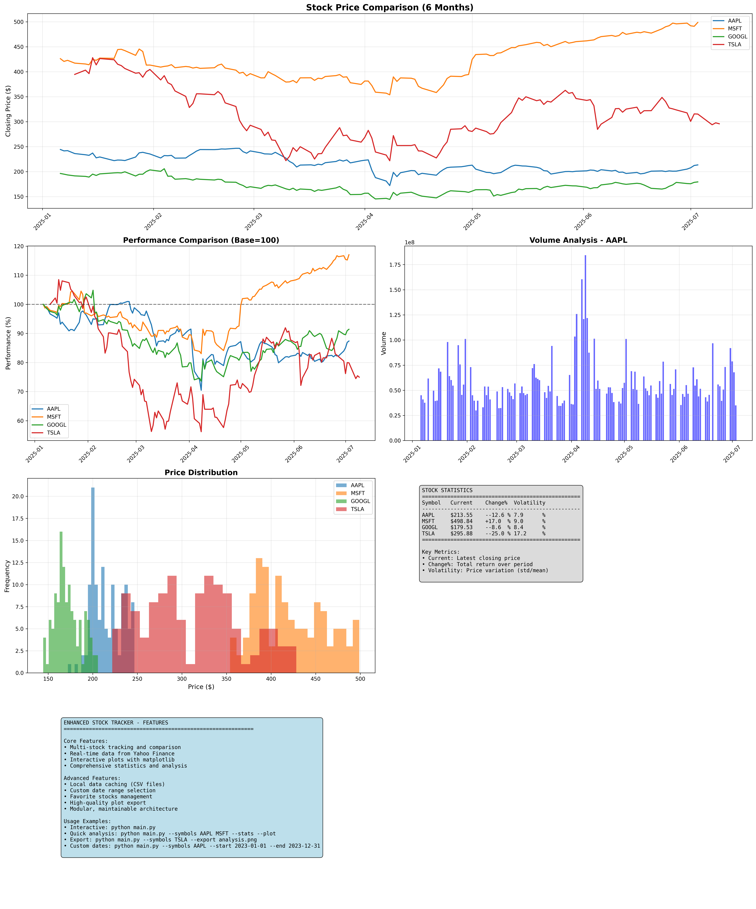

# Stock Tracker — Python Finance Project

A robust Python application for tracking, analyzing, and visualizing stock market data.

## Overview
Stock Tracker enables users to fetch historical stock prices, compare multiple companies, and generate insightful visualizations and statistics. The tool is designed for finance enthusiasts, analysts, and anyone interested in exploring stock data programmatically.

## Key Features
- Fetch historical stock data for any number of companies
- Visualize price trends, comparisons, and performance charts
- Generate summary statistics (max, min, average, percent change, volatility)
- Export plots as high-quality PNG images
- Modular, well-documented codebase for easy extension

## Technologies Used
- **Python 3.7+**
- **pandas** — Data manipulation
- **matplotlib** — Data visualization
- **yfinance** — Stock data retrieval
- **numpy** — Numerical calculations

## Setup & Installation
1. **Clone the repository:**
   ```bash
   git clone https://github.com/PranaviImmanni/Portfolio.git
   cd Portfolio/stock-tracker-Python-Finance
   ```
2. **Install dependencies:**
   ```bash
   pip install -r requirements.txt
   ```
3. **Run the application:**
   ```bash
   python main.py
   ```

## Usage
- Use the interactive CLI to select stocks, date ranges, and view statistics.
- Visualizations and statistics are generated automatically and can be exported.
- Sample data is provided in the `data/` folder for demonstration.

## File Structure
- `main.py` — Application entry point and CLI
- `stock_data.py` — Stock data fetching and caching
- `plotter.py` — Visualization and plotting utilities
- `utils.py` — Helper functions
- `data/` — Sample CSV files with stock data
- `images/` — Generated plots and visualizations
- `requirements.txt` — Python dependencies

## Example Output


---

## License
MIT License

---

**Questions or suggestions?**  
Email: pranavi@immanni.com  
[LinkedIn: Pranavi Immanni](https://www.linkedin.com/in/pranavi-immanni-ab04a823b)
